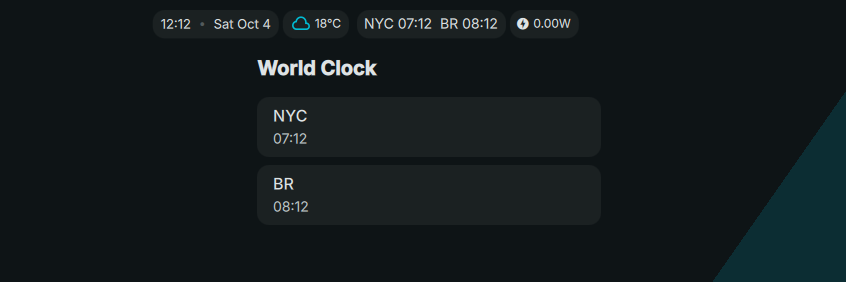

# WorldClock Plugin for DMS

A plugin that displays multiple timezones in the DMS bar.




## Installation

```bash
mkdir -p ~/.config/DankMaterialShell/plugins/
git clone https://github.com/rochacbruno/WorldClock ~/.config/DankMaterialShell/plugins/WorldClock
```

## Usage

1. Open DMS Settings <kbd>Super + , </kbd>
2. Go to the "Plugins" tab
3. Enable the "World Clock" plugin
4. Configure timezones in the plugin settings
5. Add the "worldClock" widget to your DankBar configuration

## Configuration

The plugin stores timezone configurations in the DMS settings. You can add/remove timezones through the plugin settings interface.

### Common Timezone Examples:
- America/New_York (Eastern Time)
- America/Los_Angeles (Pacific Time)
- Europe/London (Greenwich Mean Time)
- Europe/Paris (Central European Time)
- Asia/Tokyo (Japan Standard Time)
- Australia/Sydney (Australian Eastern Time)

## Files

- `plugin.json` - Plugin manifest and metadata
- `WorldClockWidget.qml` - Main widget component
- `WorldClockSettings.qml` - Settings interface
- `timezone-utils.js` - Timezone utility functions
- `moment.js` - Moment.js library (stub - replace with real file)
- `moment-timezone.js` - Moment timezone library (stub - replace with real file)

## Permissions

This plugin requires:
- `settings_read` - To read timezone configurations
- `settings_write` - To save timezone configurations


